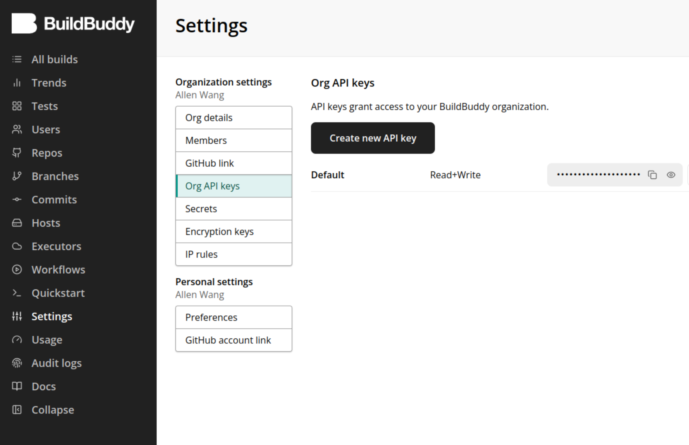

# bazel-playground

bazel project to learn bazel ecosystem
<!-- TOC depthfrom:2 -->

- [QuickStart](#quickstart)
    - [Dependencies](#dependencies)
    - [Define Tasks](#define-tasks)
    - [Run Tasks](#run-tasks)
- [Install Bazel](#install-bazel)
- [Set up Bazel Workspace](#set-up-bazel-workspace)
- [Set up Bazel Python Environment](#set-up-bazel-python-environment)
- [Import External Packages](#import-external-packages)
- [Setup BuildBuddy](#setup-buildbuddy)
- [Run Test and Coverage in Bazel](#run-test-and-coverage-in-bazel)
- [Package Rules](#package-rules)
- [Pre-commit](#pre-commit)
- [CI Workflow](#ci-workflow)

<!-- /TOC -->


## QuickStart

### Dependencies

- [Bazel](#install-bazel)
- lcov (for genhtml)

  ```bash
  sudo apt install lcov
  ```

- python 3.7+
- cmake 3.16.0+
- pre-commit

  ```
  sudo apt install pre-commit
  ```

### Define Tasks

Go to [`tasks.yaml`](./tasks.yaml) and add new tasks.

### Run Tasks

Use the CLI tool [`run`](run) to run predefined tasks:

```bash
Usage: ./run <task-name>
Options:
    --list    List all available tasks.
    --help    Print this help message.

```

## Install Bazel

- Install through [Bazelisk](https://github.com/bazelbuild/bazelisk/releases).

  ```bash
    wget https://github.com/bazelbuild/bazelisk/releases/download/v1.23.0/bazelisk-amd64.deb
    sudo dpkg -i bazelisk-amd64.deb
    which bazelisk
  ```

- Add [`.bazeliskrc`](.bazeliskrc) to choose Bazel version

  ```bash
    BAZELISK_HOME=.bazelisk
    USE_BAZEL_VERSION=6.5.0
  ```

- Check Bazel version

  ```bash
  bazel version
  bazelisk version
  ```

## Set up Bazel Workspace

- Create WORKSPACE.bazel
- Import common used functions

  ```bash
    load("@bazel_tools//tools/build_defs/repo:http.bzl", "http_archive")
    load("@bazel_tools//tools/build_defs/repo:git.bzl", "git_repository")
  ```

- Import needed dependencies of Bazel project, eg. bazel python rules:

  ```bash
    http_archive(
        name = "rules_python",
        sha256 = "9d04041ac92a0985e344235f5d946f71ac543f1b1565f2cdbc9a2aaee8adf55b",
        strip_prefix = "rules_python-0.26.0",
        url = "https://github.com/bazelbuild/rules_python/releases/download/0.26.0/rules_python-0.26.0.tar.gz",
    )

    load("@rules_python//python:repositories.bzl", "py_repositories", "python_register_toolchains")

    py_repositories()

    python_register_toolchains(
        name = "python_3_10",
        python_version = "3.10",
        register_coverage_tool = True,
    )

    load("@python_3_10//:defs.bzl", _python_interpreter = "interpreter")
    load("@rules_python//python:pip.bzl", "pip_parse")

    pip_parse(
        name = "python_deps",
        python_interpreter_target = _python_interpreter,
        requirements_lock = "//:requirements_lock.txt",
    )

    load("@python_deps//:requirements.bzl", "install_deps")

    install_deps()
  ```

- Create [`BUILD.bazel`](BUILD.bazel) to mark the repo as a bazel pkg
- Create [`.bazelrc`](.bazelrc) to specify the bazel operation configurations

## Set up Bazel Python Environment

- Import python dependencies into bazel [`WORKSPACE`](#set-up-bazel-workspace)
- Create [`requirements.txt`](requirements.txt) to specify needed python packages

  Unlike C/C++, all Python dependencies cannot be import into WORKSPACE directly, instead, they need to be imported through `requirements.txt`

- Create an empty `requiremens_lock.txt` and add Bazel rule to update python requirements

  ```bash
    load("@rules_python//python:pip.bzl", "compile_pip_requirements")
    compile_pip_requirements(
        name = "py-deps",
        timeout = "moderate",
        requirements_in = "//:requirements.txt",
        requirements_txt = "//:requirements_lock.txt",
    )
  ```

- Generate contents into [`requiremens_lock.txt`](requirements_lock.txt)

  ```bash
    ./run py-deps
  ```

## Import External Packages

Take cyclonedds for example:

- Add external package into [`WORKSPACE`](WORKSPACE.bazel):

  ```bazel
  http_archive(
    name = "cyclonedds",
    sha256 = "495ace40b51025d1465bd10a8c6c0f36a1a3a03a97f8e6d4582a06086644c3b8",
    strip_prefix = "cyclonedds-0.11.0",
    build_file = "//external_bazel_templates:BUILD.bazel.cyclonedds",
    url = "https://github.com/allenwang-git/cyclonedds/archive/refs/tags/0.11.0.tar.gz",
  )
  ```

- Add customized [`BUILD`](external_bazel_templates/BUILD.bazel.cyclonedds) file for external package

- Refer to it when define bazel target:

  ```bazel
  cc_library(
    name = "c_idl",
    srcs = [
        "idl/HelloWorldData.h",
        "idl/HelloWorldData.c",
    ],
    deps = ["@cyclonedds"],
    visibility = ["//visibility:public"],
  )
  ```

## Setup BuildBuddy

- Assuming a buildbuddy account has been created, if not, go to https://www.buildbuddy.io/ to create one.

- Get the buildbuddy API key from https://app.buildbuddy.io/settings/org/api-keys

  

- Add buildbuddy configurations into [.bazelrc](./.bazelrc):
  ```bash
  build --bes_results_url=https://app.buildbuddy.io/invocation/
  build --bes_backend=grpcs://remote.buildbuddy.io
  build --build_metadata=REPO_URL=https://github.com/<repo>.git
  build --build_metadata=USER=<user-name>
  ```

- Add buildbuddy api key into git global config
  ```bash
  git config --global buildbuddy.api-key <org-api-key>
  ```

- Create [buildbuddy credential helper script](./buildbuddy_credential_helper) and add following contents:
  ```bash
  #!/bin/bash

  set -euo pipefail

  if [[ -z "${BUILD_BUDDY_API_KEY:-}" ]]; then
    BUILD_BUDDY_API_KEY=$(git config buildbuddy.api-key)
  fi

  echo '{
    "headers": {
      "x-buildbuddy-api-key": ["'"${BUILD_BUDDY_API_KEY}"'"]
    }
  }'
  ```

- Add credential helper into [`./bazelrc`](./.bazelrc)
  ```bash
  build --credential_helper=%workspace%/buildbuddy_credential_helper
  ```

- Now buildbuddy is all set and all build results will be uploaded to your remote buildbuddy cloud. eg.
  ```bash
  INFO: Streaming build results to: https://app.buildbuddy.io/invocation/6fe45c1d-a7e9-4335-a4e3-a0c7c47cf8ef
  INFO: Analyzed target //cc:cc_sub (1 packages loaded, 2 targets configured).
  INFO: Found 1 target...
  Target //cc:cc_sub up-to-date:
    bazel-bin/cc/cc_sub
  INFO: Elapsed time: 19.744s, Critical Path: 19.45s
  INFO: 13 processes: 8 internal, 5 linux-sandbox.
  INFO: Running command line: bazel-bin/cc/cc_sub
  INFO: Streaming build results to: https://app.buildbuddy.io/invocation/6fe45c1d-a7e9-4335-a4e3-a0c7c47cf8ef
  INFO: Build completed successfully, 13 total actions
  ```

## Run Test and Coverage in Bazel

For cc codes, defined `cc_test` targets, while for python codes, define `py_test` targets.

- To run all tests in this repo, use `bazelisk test //... <options>`.

  NOTES: If use `py_test` to do integration test for cc codes, the tests cannot be used to calculate coverage for cc codes, unless use native `pytest` command. In other words, `cc_binary` targets cannot be test directly.

- To calculate unit test coverage, use `bazelisk coverage //python/... <options>` or `bazelisk coverage //cc/... <options>`

- To enable branch coverage, add this option `--action_env=COVERAGE_GCOV_OPTIONS=-b`.

- To generate coverage report, use `genhtml` command.

- There are multiple ways to run integration tests, tests written in Python, shell, or C/C++ languages can be run with `py_test`,
  `sh_test` and `cc_test` respectively. Go to [cc/test/integration](./cc/test/integration/) for more details.

## Package Rules

To package in Bazel, [rules_pkg](https://bazelbuild.github.io/rules_pkg) is needed.

- Import rules_pkg into WORKSPACE:

  ```bazel
  http_archive(
      name = "rules_pkg",
      urls = [
          "https://mirror.bazel.build/github.com/bazelbuild/rules_pkg/releases/download/0.9.0/rules_pkg-0.9.0.tar.gz",
          "https://github.com/bazelbuild/rules_pkg/releases/download/0.9.0/rules_pkg-0.9.0.tar.gz",
      ],
      sha256 = "335632735e625d408870ec3e361e192e99ef7462315caa887417f4d88c4c8fb8",
  )

  load("@rules_pkg//:deps.bzl", "rules_pkg_dependencies")

  rules_pkg_dependencies()
  ```

- Define bazel targets:

  ```bash
  pkg_tar(
    name = "cc_tar",
    srcs = [
        "//cc:cc_pub",
        "//cc:cc_sub",
        ":cyclonedds-deps",
    ],
    extension = "tar.gz",
    mode = "0555", # r-xr-xr-x
    package_file_name = "cc-pub-sub-{cc_cpu}-{compiler}-{compilation_mode}-{version}.tar.gz",
    package_variables = ":pkg_vars",
    visibility = ["//visibility:public"],
  )
  ```

  Package Variables:
  - `version`: passed from CLI argument
  - `cc-cpu`, `compier`, `compilation_mode`: passed from toolchain info

  All package variables are defined in target [`pkg_vars`](pkg/pkg_vars.bzl):

  ```bash
  def _pkg_vars(ctx): # Functions starting with '_' are private functions and cannot be imported into other files
    """var wrapper for both version and toolchain vars"""
    version = version_from_cli_impl(ctx)
    toolchain = names_from_toolchains_impl(ctx)

    values = {}
    values.update(version)
    values.update(toolchain)
    return PackageVariablesInfo(values = values)

  pkg_vars = rule(
    implementation = _pkg_vars,
    # Going forward, the preferred way to depend on a toolchain through the
    # toolchains attribute. The current C++ toolchains, however, are still not
    # using toolchain resolution, so we have to depend on the toolchain
    # directly.
    # TODO(https://github.com/bazelbuild/bazel/issues/7260): Delete the
    # _cc_toolchain attribute.
    attrs = {
        "_cc_toolchain": attr.label(
            default = Label(
                "@rules_cc//cc:current_cc_toolchain",
            ),
        ),
    },
    toolchains = ["@rules_cc//cc:toolchain_type"],
    incompatible_use_toolchain_transition = True,
    # For version
    build_setting =config.string(flag=True),
    provides = [PackageVariablesInfo],
  )
  ```

- Build package with `bazelisk build` command and version number:

  ```bash
  bazelisk build //pkg:cc_tar --//pkg:pkg_vars=0.0.1
  ```

## Pre-commit

- Make sure the pre-commit tool is installed.

- Create pre-commit [config file](./.pre-commit-config.yaml) and add pre-commit hooks.

- To run pre-commit check:

  ```bash
  ./run pre-commit
  ```
- To add more pre-commit-hooks: https://pre-commit.com/hooks.html

- For more info about pre-commit tool: https://pre-commit.com/index.html


## CI Workflow

- Setup self-hosted CI runner, follow the instruction [here](https://github.com/allenwang-git/bazel-playground/settings/actions/runners)
  - Start the runner with `./actions-runner/run.sh`
  - Make sure the runner labels in workflow matche the runners

- Create a new github workflow `./github/workflows/run-tasks.yaml`

- Add trigger conditions for this workflow:

  ```yaml
  on:
    push:
      branches:
        - main  # Trigger the workflow when pushing to the main branch
    pull_request:
      branches:
        - main  # Also trigger on pull requests targeting main branch
  ```
  Reference: https://docs.github.com/en/actions/writing-workflows/choosing-when-your-workflow-runs/triggering-a-workflow

- Create a new job called `tasks` and set the runner labels to `[self-hosted, X64, Linux]` so that the workflow will run on self-hosted runners

  ```yaml
  jobs:
    tasks:  # job id
      runs-on: [self-hosted, X64, Linux]
      strategy:
        matrix:
          task: [  # tasks to run, "task" here is a variable name
            pre-commit,
            py-test,
            py-cov,
            cc-test,
            cc-cov,
            cc-tar
          ]
        fail-fast: true  # job fails immediately if any task fails
  ```

- Define job steps:
  ```yaml
  steps:
    # Checkout the code
    - name: Checkout code
      uses: actions/checkout@v3
      with:
        clean: false  # clean is an env var used in actions/checkout@v3

    # Install dependencies
    - name: Install dependencies
      run: |
        sudo apt install -y lcov pre-commit &&
        wget https://github.com/bazelbuild/bazelisk/releases/download/v1.23.0/bazelisk-amd64.deb &&
        sudo dpkg -i bazelisk-amd64.deb &&
        which bazelisk

    # Run tasks
    - name: Run tasks
      run: ./run ${{ matrix.task }}
  ```

- Syntax of github workflow: https://docs.github.com/en/actions/writing-workflows/workflow-syntax-for-github-actions
